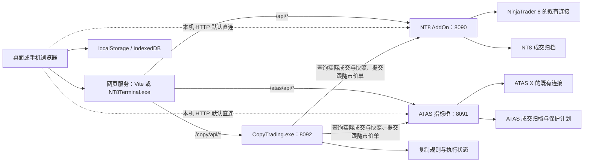

# 项目架构与发布流程

更新：2026-09-14。按代码基线 `3aa684e` 及本次 ATAS SSE 断连误报修复整理。操作命令见 [开发与验证](docs/开发与验证.md)，新对话先读 [接续工作](docs/接续工作.md)。原来的逐次开发记录保存在 [历史实现记录](docs/历史实现记录.md)。

## 1. 总体架构

浏览器负责界面、图表和回放模拟。NT8 / ATAS 桥运行在已登录平台内，提供原生行情、账户和交易接口，并独立记录实际成交。复制交易由单独后台进程处理，不依赖网页保持打开。

| 服务 | 端口与入口 | 生命周期 |
|---|---|---|
| Vite 开发 / 预览 | 启动脚本显式使用 7100；直接 `npm run dev` 默认 3000 | 随 Node 进程；不会自动启动复制后台 |
| `NT8Terminal.exe` | 默认 `127.0.0.1:7200`，可调整端口与 `--host` | 托管 `app/dist` 或旁边的 `dist`；复制程序存在且 8092 空闲时隐藏启动它 |
| NT8 AddOn | `127.0.0.1:8090` | 随 NT8 加载 / 关闭 |
| ATAS 指标桥 | `127.0.0.1:8091` | 同进程指标共享服务；最后一个桥接指标移除时停止 |
| 复制交易后台 | `127.0.0.1:8092` | 独立进程；关网页或网页服务不停止跟单 |

`config.ts` 的默认行为：远程 / HTTPS 页面通过网页服务的同源代理访问；本机 HTTP 回环页面直连 NT8 / ATAS，可手动覆盖地址。复制服务始终走 `/copy/api` 代理。`start.bat` 使用 `0.0.0.0:7100`，`start.sh` 使用 `127.0.0.1:7100`，不能把所有开发入口概括为“仅回环”。HTTPS 代理需转发三条 API 路径、保留 Host、关闭 SSE 缓冲；复制入口另有同源校验。项目没有用户登录和多租户权限系统。

## 2. 目录与技术栈

| 目录 / 文件 | 职责 |
|---|---|
| `app/src/` | React 19、TypeScript、Vite、Tailwind 界面及浏览器端状态 |
| `app/public/charting_library/` | 当前运行资源，Charting Library v32.1.0；纯图表版 |
| `charting_library_v32.1/`、`charting_library_v29.4/` | 本地原始库副本，Git 忽略；不是直接运行入口 |
| `nt8-bridge/TvBridgeAddOn.cs` | 单文件 NT8 AddOn，HTTP / SSE、数据、交易、保护单与归档 |
| `atas-bridge/` | .NET 10 指标 DLL；已验证 ATAS X 8.0.14.646 / 8.0.15.643 beta |
| `copy-trading/` | .NET 10 / ASP.NET Core 后台，成交跟随与持久化 |
| `server/StaticServer.cs` | .NET Framework 单文件静态服务器与三路代理 |
| `scripts/` | 回归、只读诊断、绘图库同步工具 |
| `docs/` | 接续、操作验证与历史记录 |
| `.build-check/`、`.tmp-webbridge/` | 本地编译、测试、截图和备份，Git 忽略 |

`Nt8Account` / `Nt8Position` 等名称是沿用的共享数据类型，不代表调用一定进入 NT8。

## 3. 前端功能模块

`App.tsx` 挂载 `sections/ChartTerminal.tsx`。后者协调页面、桥连接、账户轮询、当前行情源、图表 workspace、回放和复制入口。交易快照轮询为 500ms，独立的真实账户汇总轮询为 3 秒。

| 功能 | 主要文件（相对 `app/src/`） | 当前行为 |
|---|---|---|
| 主导航 / 连接 | `sections/ChartTerminal.tsx`、`components/BridgeConnectionStatus.tsx`、`lib/config.ts` | 交易图表、监控面板、账户总览、交易记录、回放模拟、复制交易；两桥状态分开 |
| 监控面板 | `sections/MonitorPage.tsx`、`components/MonitorAccountCard.tsx`、`MonitorChart.tsx`、`MonitorPageLoader.tsx`、`lib/monitorData.ts` | 有持仓实盘账户各一卡片：余额、实时浮盈、lightweight-charts K 线 + 持仓 / TP / SL 线；3 秒轮询 + 每选中合约一条 SSE；含隐藏账户；只读 |
| 多图表 / 布局 | `components/ChartWorkspace.tsx`、`TvAdvancedChart.tsx`、`lib/tvLayoutStore.ts`、`tvLayoutEvents.ts` | 桌面 1 / 2 / 4 图，各图独立绘图和布局；原生保存、打开、重命名、删除、自动保存 |
| 搜索与收藏 | `components/SymbolFavorites.tsx`、`hooks/useDraggable.ts`、`lib/symbolSearch.ts` | 可拖动搜索栏、收藏排序；NT8 搜索只给平台当前月份，历史月份仍可精确解析 |
| 交易与账户侧栏 | `sections/TradingPanel.tsx`、`lib/nt8Trading.ts`、`bridgeAccounts.ts`、`tradingRouter.ts` | 两个独立面板在右侧左右并排；展示所选账户全部合约的持仓和工作单 |
| 下单与保护线 | `hooks/useOrderLines.ts`、`usePendingBracketLines.ts`、`useDraftLines.ts`、`lib/draftCalc.ts` | 实际订单 / 均价线、未成交 TP/SL 预览、草稿金额换算；拖线改价、删工作单线撤单 |
| 图上成交标记 | `hooks/useExecutionTrades.ts`、`lib/tvExecutionArrow.ts`、`executionPairs.ts` | 买绿向上、卖红向下小箭头，尖端对齐成交点；切周期用原始成交时间重建 |
| 右键交易菜单 | `lib/tvContextMenu.ts`、`components/ChartWorkspace.tsx` | 每个 widget 一个转发回调，数量变化替换菜单提供者，防止累积旧选项 |
| 账户总览 | `sections/AccountPages.tsx` | 两桥全部账户按连接分组，卡片 / 列表切换；标准币种 USD；没有账户选择器 |
| 交易记录与统计 | `components/TradeHistory.tsx`、`PerformanceSummary.tsx`、`lib/tradeRecords.ts`、`tradeHistoryFilters.ts`、`tradeAnalytics.ts` | 完整归档先 FIFO 配对；入场价、离场价、盈亏；按组 / 账户 / 合约 / 日期筛选，统计在上方 |
| 交易详情 | `components/TradeDetailsLoader.tsx`、`TradeDetails.tsx` | 独立 lightweight-charts 图，使用成交所属行情源；局部错误边界隔离加载失败 |
| 历史查询缓存 | `lib/historyStore.ts` | IndexedDB 统一缓存两桥成交，后台同步，离线浏览已缓存记录 |
| 回放 dashboard | `sections/ReplayDashboard.tsx`、`ReplayBar.tsx`、`lib/replayStore.ts` | 新建、继续、删除 session，独立资金、统计和成交 |
| 回放数据与撮合 | `lib/replaySession.ts`、`replayFeed.ts`、`simTrading.ts`、`tradingRouter.ts` | 历史只揭示到游标，交易路由到浏览器本地模拟引擎 |
| 复制交易页面 | `sections/CopyTradingPage.tsx`、`lib/copyTrading.ts` | 保存规则、启停、显示后台状态和日志；执行逻辑不在浏览器 |
| 手机适配 | `components/MobileNavigation.tsx`、`hooks/useMobilePanelHeight.ts`、`index.css` | 小于 1024px：菜单导航、单图、图表上 / 面板下、可拖高度、紧凑控件；保留桌面偏好 |

隐藏账户是用户偏好：侧栏卡片灰化并保留恢复入口，交易下拉排除该账户；仅手动恢复才能移除隐藏记录。账户暂缺、轮询、重连不清理隐藏名单。总览和历史归档不因侧栏隐藏而删除数据。“所有持仓 / 工作单”指**所选账户全部合约**，不是所有账户仓位聚合。

交易记录每页 100 笔配对 / 未配对记录。已平仓按离场时间筛选并倒序排列，未配对按原成交时间；在完整记录上配对后再筛选，跨日入场不能被提前删掉。手续费列已移除，取得的手续费仍按配对数量分摊进净盈亏；缺资料不伪造数值。

## 4. 行情、账户与绘图边界

### 行情链路

`TvDatafeed` 实现 TradingView JS API → `FeedAdapter` → `nt8Bridge.ts` 的平台适配器 → 地址配置选择的直连 / 同源代理 → 原生桥。历史用 HTTP，实时用 SSE。换行情源必须失效旧请求、订阅和最新价 / 时间桶缓存。普通切页面保留图表，进入 / 退出回放重建对应上下文。

ATAS 桥版本 5 将 SSE 数据帧 / 心跳写入或刷新时的客户端传输断开按该订阅取消处理，不写入全局 `marketError`。异常分类只限下游写入边界；原生行情断线、历史请求失败和队列溢出仍走行情错误路径。

NT8 历史按完整交易日扩窗后裁回请求范围，能力为 `historyWindowVersion=1`；前端兼容旧桥宽窗。bar 有序、去重并按 `[from,to)` 过滤，每页最多 500 根。周末空页不能直接当历史结束，使用 `nextTime` 跳空窗。SSE 重连补真实历史，真实缺口不填假 K 线。

NT8 搜索使用 `currentOnly=true`，按 `MasterInstrument.GetNextExpiry` 和平台换月设置取得当前月份，不按成交量重新排名；普通解析和已有历史图表不受搜索限制。

### 账户与合约身份

浏览器统一账户键：`bridge:<provider>:<encodeURIComponent(rawName)>`，旧 NT8 名由 `bridgeAccounts.ts` 迁移。两桥同名账户不能合并，连接组只用于展示。发送给桥前还原原生账户名；复制后台使用 `{ provider, name: 原生账户名 }`。

交易合约保留完整原生 ID，不在交易路径上转换月份格式。ATAS 同根合约可能来自不同来源或连接，不能剥除 `#atas-id` 猜测匹配。

连续图表 `#MNQU6@CME` 可与实际月份持仓对应同一原生 Security。ATAS 桥按**同 connector、同 Security 对象引用**返回 `chartSymbols`，1 秒缓存。`chartInstrument.ts` 对完整 ID 忽略大小写匹配，兼容库将 `chart.symbol()` 大写化；`ChartWorkspace` 用原生目录拼写查点值和最新价。显示别名不改交易 ID、不推断跨源等价，也不用于复制映射。

### 图表事件与持久化

- 纯图表版的 `createOrderLine/createPositionLine` 不可用，订单和仓位用 `horizontal_line` 通用绘图实现。
- 拖线有价格指纹和结算标记，避免程序写点触发真实改单；线体 / 锚点位移处理不同，拖动期间不反复 `setPoints` 覆盖手势。
- `getShapeById` 可返回旧合约的隐藏图形，不代表线在当前图表可见。切合约 / 账户清理并重建受管线，失效迟到创建和旧账户事件。
- 程序清理先清受管记录再删除图形，不能触发撤单。加载布局前用 `notifyBeforeLayoutLoad` 保护交易绘图；不能让切账户清理破坏等待中的 `dataReady` 恢复回调。
- 订单、仓位、草稿和成交标记不写入布局。用户绘图 / 指标用 `save_load_adapter` 保存，各 pane、ATAS 与回放布局隔离。读取周期用 `chart.resolution()`。
- 成交箭头优先用原始 `timeMs`，缺失时回退原始 `time`，不用旧图形吸附到 K 线后的时间；尖端偏移只包装对应图标实例，不改 vendor / 全局原型 / 原始成交坐标。`tvExecutionTool.ts` 是未使用的旧实现。图中历史查最近 7 天，旧接口最多 200 条；不等同完整交易记录页，`chartSymbols` 也未扩展到全部历史标记。

位移公式、行情缺口实测和旧方案细节保留在历史记录，回归入口见开发文档。

## 5. 平台桥职责与 API

NT8 的监听、行情、账户事件、交易、保护及归档集中在 `TvBridgeAddOn.cs`。ATAS 按以下职责拆分：

| 文件（`atas-bridge/`） | 职责 |
|---|---|
| `TerminalBridgeIndicator.cs`、`BridgeHttpServer.cs` | 指标加载、共享生命周期、HTTP / SSE |
| `AtasPlatformAccess.cs` | 已验证 SDK 的全局服务、连接、合约与显示关联 |
| `AtasMarketService.cs` | 原生历史 / 实时行情 |
| `AtasTradingService.cs`、`AtasTradingPlatform.cs` | 订单、保护同步与可测试的平台接口 |
| `ExecutionJournal.cs` | 实际成交持久化 |

两桥复用已有平台登录，不向网页索要 broker / dxFeed 密码。ATAS 初始化核对 SDK 版本，升级后需重新验证，不能只放宽白名单来声称兼容。

桥管理的 TP/SL 在部分成交后生成，随同账户同合约净持仓增减调整数量并保留保护价；平仓 / 反手清理旧方向保护。不接管所有外部手工、ATM 或其他软件的保护单。ATAS 同时附加 TP+SL 需服务器 OCO，不支持时入场前拒绝；其普通拒单与真实保护同步异常分开。两桥 `/brackets` 都提供账户 `syncError`，具体错误状态和其他诊断字段仍按对应实现处理。

浏览器路径前缀为 NT8 `/api`、ATAS `/atas/api`、复制 `/copy/api`；代理去掉 `/atas` 或 `/copy`，每个服务内部均使用 `/api`。

| 桥内端点 | 方法 | 用途 |
|---|---|---|
| `/api/status`、`/api/debug` | GET | 状态、能力、归档及账户诊断；各桥具体诊断字段不同 |
| `/api/symbols`、`/api/resolve` | GET | 目录、精确解析；NT8 搜索另带 `currentOnly=true` |
| `/api/history` | GET | `symbol/interval/from/to`，interval / 时间戳单位为秒 |
| `/api/stream` | SSE | 实时 bar / 价格事件 |
| `/api/accounts` | GET | 账户及财务数据 |
| `/api/positions`、`/api/orders` | GET | 指定账户、不按图表合约过滤；ATAS 行带 `chartSymbols`；NT8 普通订单仍有 60 条截断 |
| `/api/brackets` | GET | 本桥管理的保护计划与账户 `syncError` |
| `/api/executions` | GET | 本机归档，可选账户 / 合约 / 时间，`offset/limit` 分页 |
| `/api/order/place` | POST | 市价、限价、止损、止损限价及可选保护 |
| `/api/order/cancel`、`/api/order/change` | POST | 按原生账户 / 订单 ID 撤改 |
| `/api/position/close` | POST | 按原生账户 / 完整合约平仓 |

两桥成交分页支持 `total/nextOffset`；未传分页参数时兼容最近 200 条升序标记查询，这不限制归档总量。NT8 分页最多 500 条、按源时间降序。`timeMs` 保留精确成交时间，`time` 用于按秒接口。平台当前内存成交集合不是完整历史档案。

| 源码能力标识 | 当前值 |
|---|---|
| NT8 `historyWindowVersion` / `executionArchiveVersion` | `1` / `1` |
| NT8 `symbolCatalogVersion` / `copySnapshotVersion` | `2` / `1` |
| ATAS `bridgeVersion` / `chartSymbolVersion` | `5` / `1` |
| ATAS `historyWindowVersion` / `executionArchiveVersion` | `1` / `1` |
| 复制状态 `version` | `1` |

现场需读取各 `/api/status` 确认已加载版本，不能根据源码或 DLL 存在就判断升级完成。

## 6. 复制交易的实现边界

**当前不会复制所有挂单。** 引擎读取主账户的新实际成交，主账户通过网页、NT8、ATAS 或保护单产生的成交都可被对应桥归档并跟随。

| 主账户操作 | 当前行为 |
|---|---|
| 市价开仓 / 加减仓 / 平仓 / 反手成交 | 跟随账户提交市价差量单 |
| 新挂限价 / 止损 / 止损限价，尚未成交 | 不复制委托 |
| 修改挂单价格 / 数量或撤销未成交挂单 | 不同步改单 / 撤单 |
| 挂单部分成交 | 仅按实际成交累积数量和倍率计算 |
| TP/SL 尚未触发 | 不提前给跟随账户挂同一保护单 |
| TP/SL 实际成交 | 作为新成交跟随减仓 / 退出 |
| 启用前已有仓位或旧成交 | 不补复制；启用要求全部参与账户空仓且无工作单 |

`CopyEngine.cs` 每 500ms 串行处理：目标净持仓 = 主账户自启用以来累计的带符号成交数量 × 倍率，向零取整后与已确认目标净持仓求差。支持多跟随账户、小数倍率和单笔数量上限。跨桥必须显式填写完整原生合约映射，同桥默认同名原生合约；不自动换主力或换算 NQ/MNQ。

启用建立完整成交基线；读取不完整、检查期间新成交或严格快照不满足时拒绝。运行规则的参与账户不得与其他运行规则交叉。NT8 用 `copyStrict=true` 的持仓 / 订单并要求能力标记，严格订单不采用普通界面的 60 条截断。

每次先落盘 Pending 意图，再发送一次 `MARKET/DAY` 请求，确认目标状态后更新。成交超过 15 秒、归档问题、数量超限、手动改变目标账户、缺映射、断线、存储错误或结果不明均会暂停；不自动重发不确定订单。停用尽早登记并在实际发送前检查，已发送的请求仍可能完成，停用本身不平仓。重启不自动恢复运行规则。

| 后台文件（`copy-trading/`） | 职责 |
|---|---|
| `Program.cs` | Kestrel API、worker、同源 / 本机检查、会话 mutex 与数据目录锁 |
| `CopyEngine.cs` | 规则校验、基线、差量跟随、暂停和竞态守卫 |
| `BridgeClient.cs` | 原生账户 / 合约、完整分页、严格快照、一次性市价请求 |
| `JsonStateStore.cs`、`Models.cs` | 规则、Seen ID、净持仓、Pending、日志与原子存储 |

GET：`/api/status`、`accounts`、`symbols?provider=...`、`resolve?provider=...&symbol=...`。POST：`/api/rules`、`rules/{id}/start`、`stop`、`delete`、`/api/stop-all`。修改响应返回最新快照；页面每 3 秒读取后台。

挂单生命周期复制、跟随账户提前保护、分布式多主机复制均未实现；不能从“复制交易”名称推断这些能力已经存在。

## 7. 数据存储与迁移

| 数据 | 位置 | 说明 |
|---|---|---|
| NT8 真实成交 | `NinjaTrader.Core.Globals.UserDataDir/TvBridge/executions-v1.log` | 账户 + ExecutionId 去重、追加更新与校验；以 API `archive.path` 为准 |
| ATAS 成交 / 保护 | `%LOCALAPPDATA%/TradingViewTerminal/ATAS/executions.jsonl`、`protections.json` | 独立于网页；同目录 `bridge-errors.log` 记录初始化问题 |
| 复制状态 | `%LOCALAPPDATA%/NT8Terminal/CopyTrading/state.json`、`.bak` | 原子替换与 `service.lock`；含规则 / 意图，日志最多 2000 条，API 最近 200 条 |
| 浏览器成交缓存 | IndexedDB `nt8-terminal-trade-archive` | 统一查询缓存，不能代替桥端归档 |
| 布局、账户、主题、收藏等 | localStorage，主要前缀 `nt8-terminal-`；行情源另有 `terminal-bridge-provider` | 按浏览器 origin；平台布局 / 收藏隔离 |
| 隐藏账户 | `nt8-terminal-hidden-accounts` | 统一账户 ID，不能按缺失快照删除 |
| 回放 session | `nt8-terminal-replay-session-v1:<id>` | 来源、合约、游标、资金、持仓、订单、成交；删除仅删该 session |
| 手机分隔比例 | `tv-nt8-mobile-panel-ratio` | 与桌面面板宽度独立 |

程序目录、`dist` 和 ZIP 不含运行数据。换浏览器、IP / 端口或 HTTP / HTTPS 会改变 origin，浏览器偏好和回放不会自动迁移。复制状态与两桥归档需分别备份。归档能补入平台当前仍提供的成交，但首次启用前平台已经丢失的历史无法恢复。

## 8. 发布入口

前端：`app/build.cmd` → `app/dist`。NT8：安装 `.cs` 到用户 AddOns，再由 NT8 编译加载并核对能力。ATAS：`atas-bridge/build.cmd` → `atas-bridge/dist/TvAtasBridge.dll`，按指标加载。复制：`copy-trading/build.cmd` → `copy-trading/dist`。静态 EXE 由 .NET Framework csc 编译。

`pack.bat` 构建前端、EXE、复制后台，`server/package.ps1` 生成 ZIP；**当前包不自动包含 ATAS DLL**，需单独构建交付。构建成功不代表平台已加载新桥，刷新网页不会更新 NT8 AddOn。完整命令、包结构和验证表见 [开发与验证](docs/开发与验证.md)。
